# Polyclaw — Local Simulation Trading Framework

## 1. Objective

Design a local simulation framework that lets us:

1. **Rapidly test trading ideas** — e.g. trade only sports events resolving within days, with high volatility/volume, allowing frequent intra-day trading.
2. **Run entirely locally** in mock mode against live market data (no real funds at risk) to prove a strategy before going live.
3. **Review, replay, and revise** every trade and transaction via logs, dashboards, and exportable reports so we can iterate on strategies.

---

## 2. High-Level Architecture


---

## 3. What Already Exists vs. What's New

| Component | Status | Notes |
|-----------|--------|-------|
| `MarketFetcher` | **Exists** | Fetches active events from Gamma API with tag/volume/liquidity filters |
| `PriceEngine` | **Exists** | Real-time midpoint, spread, orderbook via CLOB |
| `WebSocketManager` | **Exists** | Streams market, sports, user, RTDS channels |
| `MockExecutor` | **Exists** | Paper fills with slippage, balance, position tracking, market resolution |
| `TradeLedger` | **Exists** | SQLite journal for trades, positions, snapshots |
| `Evaluator` | **Exists** | Win rate, P&L, drawdown, strategy breakdown |
| `TradeSignal` / `MarketContext` | **Exists** | Universal signal + context dataclasses |
| `RiskConfig` | **Exists** | max position size, max open positions, max daily trades, min confidence |
| `FiltersConfig` | **Exists** | min volume, min liquidity, tag include/exclude |
| Strategy base class | **New** | ABC for pluggable strategies |
| `SportsVolatilityStrategy` | **New** | First concrete strategy targeting sports + high vol |
| `SimScheduler` | **New** | Orchestrator loop (tick-based or event-driven) |
| `StrategyRegistry` | **New** | Register / discover / compose strategies |
| `RiskGate` | **New** | Pre-trade validation using `RiskConfig` |
| `SimConfig` | **New** | Simulation-specific config (duration, tick interval, data source) |
| Historical price recorder & replay | **New** | Record live snapshots to SQLite; replay for backtesting |
| Web Dashboard (FastAPI + WebSocket) | **New** | Real-time browser UI for monitoring, reviewing, and controlling sims |
| CLI `sim` command group | **New** | `polyclaw sim run`, `sim report`, `sim compare`, `sim export` |
| Run comparison / diff tool | **New** | Compare two simulation runs side-by-side |

---

## 4. Detailed Design

### 4.1 Strategy Abstraction

A new file `polyclaw/strategy.py` introduces the base class and registry:

```python
class BaseStrategy(ABC):
    """All strategies implement this interface."""
    name: str                          # unique identifier
    description: str

    @abstractmethod
    def configure(self, config: PolyclawConfig) -> None:
        """One-time setup (filters, thresholds, etc.)."""

    @abstractmethod
    def evaluate(self, context: MarketContext) -> TradeSignal | None:
        """Given market context, return a signal or None (skip)."""

    @abstractmethod
    def should_close(self, position: Position, context: MarketContext) -> TradeSignal | None:
        """Decide whether to close/reduce an existing position."""
```

**StrategyRegistry** — a simple dict-based registry:

```python
class StrategyRegistry:
    def register(self, strategy: BaseStrategy) -> None: ...
    def get(self, name: str) -> BaseStrategy: ...
    def list_all(self) -> list[str]: ...
```

---

### 4.2 Sports Volatility Strategy (First Strategy)

New file: `polyclaw/strategies/sports_volatility.py`

This strategy encodes the user's initial idea:

| Criterion | How it's checked | Existing support |
|-----------|-----------------|-----------------|
| **Sports-related events** | `FiltersConfig.tags_include = ["sports", "nba", "nfl", "mlb", "soccer", ...]` | `MarketFetcher._passes_filters()` already filters by tags |
| **Resolves within days** | `MarketContext.time_to_resolution` ≤ N days (configurable, default 7) | `MarketContext` already has `time_to_resolution` field |
| **High volume** | `event.volume_24hr` ≥ threshold | `FiltersConfig.min_volume_24hr` exists |
| **High volatility** | Price moved > X% in recent ticks (needs price history window) | **New**: rolling price buffer per token |
| **Intra-day frequency** | Strategy can fire on every tick (no cooldown beyond risk limits) | `RiskConfig.max_daily_trades` already caps this |

**Signal logic (pseudocode):**

```
for each active sports event resolving within N days:
    fetch current midpoint, spread, orderbook
    compute volatility = stddev(recent_prices) / mean(recent_prices)
    if volatility > threshold AND spread < max_spread:
        if midpoint < fair_value_estimate:
            emit BUY signal
        elif midpoint > fair_value_estimate AND holding position:
            emit SELL signal
```

**Configuration (added to `polyclaw.config.json`):**

```json
{
  "strategies": {
    "sports_volatility": {
      "enabled": true,
      "max_days_to_resolution": 7,
      "min_volatility": 0.05,
      "max_spread": 0.04,
      "price_window_size": 20,
      "min_volume_24hr": 5000,
      "tags": ["sports", "nba", "nfl", "mlb", "nhl", "soccer", "mma", "tennis"]
    }
  }
}
```

---

### 4.3 SimScheduler — The Orchestrator

New file: `polyclaw/simulator.py`


**SimScheduler responsibilities:**

| Responsibility | Detail |
|---------------|--------|
| **Tick loop** | Configurable interval (default 30s). Runs until stopped or duration elapsed. |
| **Market scanning** | Calls `MarketFetcher.get_active_events()` with configured filters each tick. |
| **Context building** | For each qualifying market, builds `MarketContext` via `PriceEngine`. |
| **Strategy dispatch** | Passes context to each registered strategy; collects `TradeSignal`s. |
| **Risk gating** | Validates signals against `RiskConfig` before execution. |
| **Execution** | Passes approved signals to `MockExecutor`. |
| **Position monitoring** | Each tick, checks open positions for exit conditions. |
| **Snapshot** | Saves `PortfolioSnapshot` every N ticks (configurable). |
| **Graceful shutdown** | Ctrl+C or duration limit; generates final report. |

**Two operating modes:**

| Mode | Data Source | Use Case |
|------|-----------|----------|
| **Live simulation** | Real-time data from `MarketFetcher` + `PriceEngine` | Forward-testing with live prices, no real trades |
| **Historical replay** | Recorded price snapshots from SQLite | Backtesting strategies against past data |

---

### 4.4 RiskGate — Pre-Trade Validation

New file: `polyclaw/risk.py`

Centralizes the checks that are currently informal. Uses the existing `RiskConfig` dataclass.

```python
class RiskGate:
    def __init__(self, config: RiskConfig, executor: MockExecutor, ledger: TradeLedger): ...

    def check(self, signal: TradeSignal, mode: str = "mock") -> RiskVerdict:
        """Returns approved/rejected with reason."""
        # Checks (all configurable):
        # 1. signal.confidence >= config.min_confidence
        # 2. signal.size * signal.price <= config.max_position_size
        # 3. len(executor.get_open_positions()) < config.max_open_positions
        # 4. ledger.get_today_trade_count(mode) < config.max_daily_trades
        # 5. Sufficient balance for the trade
```

`RiskVerdict` is a small dataclass:
```python
@dataclass
class RiskVerdict:
    approved: bool
    reason: str = ""           # e.g. "max_daily_trades exceeded"
    signal: TradeSignal | None = None
```

---

### 4.5 Historical Price Recorder & Replay

New file: `polyclaw/recorder.py`

To enable backtesting, we need to record live market data and replay it later:

**Recording** — runs alongside live simulation or standalone:

```python
class PriceRecorder:
    """Records price snapshots to SQLite for later replay."""

    def __init__(self, db_path: str): ...

    def record_tick(self, token_id: str, midpoint: float, spread: dict,
                    orderbook_summary: dict, timestamp: datetime) -> None:
        """Store one price observation."""

    def record_event_metadata(self, event: PolymarketEvent) -> None:
        """Store event/market metadata for context reconstruction."""
```

**New SQLite tables:**

```sql
CREATE TABLE price_ticks (
    id          INTEGER PRIMARY KEY AUTOINCREMENT,
    token_id    TEXT NOT NULL,
    midpoint    REAL NOT NULL,
    bid         REAL,
    ask         REAL,
    spread      REAL,
    timestamp   TEXT NOT NULL
);
CREATE INDEX idx_price_ticks_token ON price_ticks(token_id, timestamp);

CREATE TABLE event_metadata (
    condition_id TEXT PRIMARY KEY,
    event_id     TEXT,
    slug         TEXT,
    title        TEXT,
    question     TEXT,
    tags         TEXT,  -- JSON array
    end_date     TEXT,
    neg_risk     INTEGER,
    token_id_yes TEXT,
    token_id_no  TEXT,
    recorded_at  TEXT
);
```

**Replay** — feeds recorded data to the simulator:

```python
class PriceReplayer:
    """Replays recorded price ticks as if they were live."""

    def __init__(self, db_path: str): ...

    def get_events_in_range(self, start: datetime, end: datetime) -> list[PolymarketEvent]: ...
    def get_ticks(self, token_id: str, start: datetime, end: datetime) -> list[dict]: ...
    def iter_ticks(self, start: datetime, end: datetime) -> Iterator[tuple[datetime, str, float]]:
        """Yields (timestamp, token_id, midpoint) in chronological order."""
```

---

### 4.6 Simulation Run Metadata

Each simulation run is identified and tracked:

```python
@dataclass
class SimRun:
    run_id: str              # UUID or timestamp-based
    strategy: str            # strategy name
    started_at: datetime
    ended_at: datetime | None
    config_snapshot: str     # JSON dump of full config at start
    status: str              # "running" | "completed" | "aborted"
    notes: str = ""          # user annotations
```

**New SQLite table** (in the existing ledger DB):

```sql
CREATE TABLE sim_runs (
    run_id          TEXT PRIMARY KEY,
    strategy        TEXT NOT NULL,
    started_at      TEXT NOT NULL,
    ended_at        TEXT,
    config_snapshot  TEXT NOT NULL,
    status          TEXT DEFAULT 'running',
    notes           TEXT DEFAULT ''
);

-- Add run_id column to existing trades table
ALTER TABLE trades ADD COLUMN run_id TEXT REFERENCES sim_runs(run_id);
```

This enables comparing results across different runs with different configs/strategies.

---

### 4.7 Web Dashboard

The dashboard runs as a local web server alongside the simulation engine. It provides real-time monitoring during sim runs and post-run review/analysis.

#### 4.7.1 Architecture

```mermaid
flowchart TB
    subgraph Backend["Backend — FastAPI (Python)"]
        REST["REST API<br/>/api/sim, /api/events, /api/trades, ..."]
        WS["WebSocket endpoint<br/>/ws/sim/{run_id}"]
        SimEngine["SimScheduler<br/>(runs in background thread)"]
        EventBus["EventBus<br/>(in-process pub/sub)"]
    end

    subgraph Frontend["Frontend — Single-Page App"]
        EventList["Events Panel<br/>all scanned events"]
        Selected["Selected Events<br/>markets being traded"]
        PriceChart["Price Charts<br/>live midpoint + spread"]
        Positions["Positions Panel<br/>open positions + P&L"]
        TradeLog["Trade Log<br/>all signals + fills"]
        PnLCurve["P&L Curve<br/>equity over time"]
        Controls["Sim Controls<br/>start/pause/stop/config"]
    end

    SimEngine -->|state changes| EventBus
    EventBus -->|push| WS
    WS -->|real-time updates| Frontend
    Frontend -->|queries + actions| REST
    REST --> SimEngine
```



#### 4.7.2 Tech Stack

| Layer | Choice | Rationale |
|-------|--------|----------|
| **Backend framework** | FastAPI | Async-native, built-in WebSocket support, auto-generated OpenAPI docs, already Python |
| **WebSocket** | FastAPI WebSocket + `EventBus` | Push sim state to browser in real-time; reuse existing `WebSocketManager` patterns |
| **Frontend** | Lightweight SPA (Jinja2 templates + htmx + Chart.js) **or** React (if richer interactivity needed) | Jinja2+htmx = zero build step, ships with the Python package; React = better for complex state but requires npm tooling |
| **Charts** | Lightweight Charts (TradingView) or Chart.js | Lightweight Charts is purpose-built for financial price data; Chart.js for simpler P&L curves |
| **Styling** | Tailwind CSS (CDN) or Pico CSS | Minimal setup, clean look |

> **Recommended default: Jinja2 + htmx + Lightweight Charts.** No npm/node required — everything serves from Python. Upgrade to React later if UX demands grow.

#### 4.7.3 Dashboard Pages & Panels

**Page 1 — Live Simulation Monitor** (`/`)

| Panel | Content | Data Source | Update Method |
|-------|---------|------------|---------------|
| **Sim Status Bar** | Run ID, strategy, uptime, status (running/paused/stopped) | `SimRun` | WebSocket |
| **Events List** | All scanned events with tags, volume, time-to-resolution | `MarketFetcher` results | WebSocket (each tick) |
| **Selected Markets** | Events that passed filters + strategy evaluation | Strategy output | WebSocket |
| **Price Charts** | Live midpoint line chart per tracked token (mini sparklines + expandable) | `PriceEngine` / `PriceRecorder` | WebSocket |
| **Orderbook Heatmap** | Bid/ask depth visualization for selected market | `PriceEngine.get_orderbook()` | WebSocket |
| **Open Positions** | Token, side, entry price, current price, unrealized P&L, strategy | `MockExecutor.get_open_positions()` | WebSocket |
| **Trade Feed** | Real-time stream of signals → risk check → fill result | `TradeLedger` events | WebSocket |
| **P&L Curve** | Running equity curve (balance + unrealized) | `PortfolioSnapshot` series | WebSocket |
| **Controls** | Start / Pause / Resume / Stop sim, adjust tick interval | REST API | User action |

**Page 2 — Run History & Review** (`/runs`)

| Panel | Content |
|-------|---------|
| **Runs Table** | All past sim runs with strategy, duration, total P&L, win rate, status |
| **Run Detail** | Click into a run → full trade log, P&L chart, strategy breakdown |
| **Run Comparison** | Select 2 runs → side-by-side metrics + overlaid equity curves |
| **Trade Inspector** | Click any trade → market context at time of trade, signal reasoning, fill details |
| **Annotations** | Add notes to any run or individual trade |

**Page 3 — Strategy Config** (`/config`)

| Panel | Content |
|-------|---------|
| **Live Config Editor** | View/edit strategy params (JSON form), risk limits, filters |
| **Config Diff** | Compare current config vs. a past run's config snapshot |
| **Preset Profiles** | Save/load named config profiles for quick switching |

#### 4.7.4 WebSocket Event Protocol

The backend pushes structured events to connected clients:

```python
# Event types pushed over WebSocket /ws/sim/{run_id}
@dataclass
class SimEvent:
    type: str           # event type (see below)
    timestamp: str      # ISO 8601
    data: dict          # type-specific payload

# Event types:
# "tick"              — new tick started, includes tick number + scanned event count
# "events_scanned"    — list of events evaluated this tick
# "signal_emitted"    — strategy produced a TradeSignal
# "risk_verdict"      — RiskGate approved/rejected with reason
# "trade_executed"    — MockTradeResult (fill price, slippage, balance after)
# "position_opened"   — new position created
# "position_closed"   — position closed with realized P&L
# "position_updated"  — current price / unrealized P&L changed
# "snapshot"          — PortfolioSnapshot taken
# "price_update"      — midpoint/spread change for a tracked token
# "sim_status"        — status change (started, paused, resumed, stopped, completed)
# "error"             — strategy or execution error
```

#### 4.7.5 REST API Endpoints

```
GET    /api/sim/runs                     # list all sim runs
POST   /api/sim/start                    # start a new sim run
POST   /api/sim/{run_id}/pause           # pause running sim
POST   /api/sim/{run_id}/resume          # resume paused sim
POST   /api/sim/{run_id}/stop            # stop sim gracefully
GET    /api/sim/{run_id}                 # run metadata + summary stats
GET    /api/sim/{run_id}/trades          # all trades for a run
GET    /api/sim/{run_id}/positions       # current open positions
GET    /api/sim/{run_id}/snapshots       # portfolio snapshots (for P&L curve)
GET    /api/sim/{run_id}/events          # events scanned in current/last tick
GET    /api/sim/{run_id}/prices/{token}  # price history for a token
GET    /api/sim/{run_id}/report          # full EvaluationReport
GET    /api/sim/compare?a={id}&b={id}    # compare two runs
GET    /api/events/active                # current active Polymarket events
GET    /api/config                       # current config
PUT    /api/config                       # update config (hot-reload)
GET    /api/export/{run_id}?format=csv   # export trades
POST   /api/sim/{run_id}/annotate        # add note to a run
POST   /api/trades/{trade_id}/annotate   # add note to a trade
```

#### 4.7.6 EventBus — Connecting SimScheduler to Dashboard

New in-process pub/sub so the sim engine can broadcast state without coupling to the web layer:

```python
class EventBus:
    """In-process pub/sub for sim events."""
    def __init__(self):
        self._subscribers: dict[str, list[Callable]] = defaultdict(list)

    def subscribe(self, event_type: str, callback: Callable) -> None: ...
    def publish(self, event: SimEvent) -> None:
        """Notify all subscribers for this event type + wildcard '*' subscribers."""

    async def publish_async(self, event: SimEvent) -> None:
        """Async variant for use in async contexts."""
```

The `SimScheduler` publishes events → `EventBus` → WebSocket handler fans out to connected browsers.


#### 4.7.7 Dashboard Wireframe

```
┌─────────────────────────────────────────────────────────────────────────────┐
│  Polyclaw Simulation Dashboard          [Run: abc123] [▶ Running 2h]  │
├─────────────────────────────────────────┬───────────────────────────────────┤
│  SCANNED EVENTS (15)                │  PRICE CHARTS                    │
│  ┌─────────────────────────────┐    │  ┌─────────────────────────────┐ │
│  │ ★ Lakers vs Celtics  2d     │    │  │  Lakers Yes ───────╱──      │ │
│  │   Vol: $45k  Tag: nba       │    │  │  0.65          ──╱         │ │
│  │   Yes: 0.62  No: 0.38      │    │  │  0.55     ───╱──           │ │
│  │ ★ Chiefs vs Eagles   1d     │    │  │  0.45  ╱──                 │ │
│  │   Vol: $120k Tag: nfl       │    │  │  0.35 ╱                    │ │
│  │   Yes: 0.71  No: 0.29      │    │  │       ╱                    │ │
│  │   Man City vs Arsenal 3d   │    │  └─────────────────────────────┘ │
│  │   Vol: $28k  Tag: soccer    │    │  ┌─────────────────────────────┐ │
│  │   Yes: 0.45  No: 0.55      │    │  │  Equity Curve               │ │
│  └─────────────────────────────┘    │  │  $1,050 ─────────╱          │ │
│                                     │  │  $1,000 ────────╱           │ │
│  OPEN POSITIONS (3)                 │  │  $950  ───╱────             │ │
│  ┌─────────────────────────────┐    │  └─────────────────────────────┘ │
│  │ Token     Side Entry  P&L   │    │                                  │
│  │ Lakers-Y  BUY  0.55  +$12  │    │  TRADE FEED                      │
│  │ Chiefs-Y  BUY  0.68  -$3   │    │  ┌─────────────────────────────┐ │
│  │ Arsenal-N BUY  0.52  +$5   │    │  │ 14:32 BUY Lakers-Yes @0.55  │ │
│  └─────────────────────────────┘    │  │ 14:33 ✓ Filled @0.551      │ │
│                                     │  │ 14:35 SELL signal → rejected│ │
│  ┌──────────────────────────┐       │  │       (max_daily exceeded)  │ │
│  │ [⏸ Pause] [⏹ Stop]      │       │  │ 14:40 BUY Chiefs-Yes @0.68 │ │
│  │ [📊 Report] [⚙ Config]  │       │  │ 14:40 ✓ Filled @0.682     │ │
│  └──────────────────────────┘       │  └─────────────────────────────┘ │
├─────────────────────────────────────┴───────────────────────────────────┤
│ Balance: $982.50 │ Unr P&L: +$14.00 │ Trades: 5 │ Win Rate: 60%       │
└─────────────────────────────────────────────────────────────────────────┘
```

---

### 4.8 Enhanced Evaluator

Extend the existing `Evaluator` class:

| New Method | Purpose |
|-----------|--------|
| `generate_report(run_id=...)` | Scoped to a specific simulation run |
| `compare_runs(run_id_a, run_id_b)` | Side-by-side comparison of two runs |
| `get_trade_timeline(run_id)` | Chronological list with running P&L |
| `get_hourly_breakdown(run_id)` | Trades/P&L grouped by hour (for intra-day analysis) |

### 4.9 Export

```python
class SimExporter:
    def to_csv(self, run_id: str, output_path: str) -> None: ...
    def to_json(self, run_id: str, output_path: str) -> None: ...
    def summary_markdown(self, run_id: str) -> str: ...
```

### 4.10 CLI Commands

The CLI remains for launching sims and quick queries (the web dashboard is for monitoring):

```
polyclaw sim run      --strategy sports_volatility --duration 4h --tick 30s
polyclaw sim run      --strategy sports_volatility --duration 4h --dashboard
polyclaw sim list                              # list all past runs
polyclaw sim report   --run <run_id>           # detailed report for a run
polyclaw sim compare  --run <id_a> --run <id_b> # diff two runs
polyclaw sim export   --run <run_id> --format csv --output trades.csv
polyclaw sim replay   --from 2026-02-20 --to 2026-02-27 --strategy sports_volatility
polyclaw sim record   --duration 24h           # record live price data for later replay
polyclaw dashboard                            # launch dashboard web server standalone
```

---

## 5. Data Flow: End-to-End Simulation Run


---

## 6. File / Folder Structure (New & Changed)

```
polyclaw/
    strategy.py              # NEW — BaseStrategy ABC + StrategyRegistry
    strategies/              # NEW — strategy implementations
        __init__.py
        sports_volatility.py # NEW — first concrete strategy
    simulator.py             # NEW — SimScheduler orchestrator
    risk.py                  # NEW — RiskGate pre-trade validation
    recorder.py              # NEW — PriceRecorder + PriceReplayer
    exporter.py              # NEW — CSV/JSON/Markdown export
    event_bus.py             # NEW — in-process pub/sub for sim events
    dashboard/               # NEW — web dashboard
        __init__.py
        app.py               # FastAPI app setup, REST routes, WebSocket handler
        routes.py            # API route handlers (sim control, data queries)
        ws_handler.py        # WebSocket connection manager + EventBus subscriber
        templates/           # Jinja2 HTML templates
            base.html        # layout + nav
            monitor.html     # live simulation monitor page
            runs.html        # run history & review page
            run_detail.html  # single run deep-dive
            config.html      # config editor page
        static/              # JS, CSS, chart libs
            app.js           # htmx setup, WebSocket client, chart init
            charts.js        # Lightweight Charts / Chart.js wrappers
            style.css        # Tailwind or Pico CSS overrides
    cli.py                   # CHANGED — add `sim` + `dashboard` command groups
    config.py                # CHANGED — add SimConfig, StrategyConfig, DashboardConfig
    models.py                # CHANGED — add SimRun, RiskVerdict, SimEvent dataclasses
    ledger.py                # CHANGED — add sim_runs table, run_id on trades
    evaluator.py             # CHANGED — add run-scoped reports + compare
tests/
    test_strategy.py         # NEW
    test_simulator.py        # NEW
    test_risk.py             # NEW
    test_recorder.py         # NEW
    test_sports_volatility.py # NEW
    test_dashboard.py        # NEW — API route tests (FastAPI TestClient)
    test_event_bus.py        # NEW — EventBus pub/sub tests
```

---

## 7. Configuration Changes

Add to `polyclaw.config.json`:

```json
{
  "simulation": {
    "default_tick_interval_seconds": 30,
    "default_duration_minutes": 240,
    "snapshot_every_n_ticks": 10,
    "record_prices": true,
    "price_db_path": "./data/price_history.db"
  },
  "dashboard": {
    "host": "127.0.0.1",
    "port": 8420,
    "auto_open_browser": true
  },
  "strategies": {
    "sports_volatility": {
      "enabled": true,
      "max_days_to_resolution": 7,
      "min_volatility": 0.05,
      "max_spread": 0.04,
      "price_window_size": 20,
      "min_volume_24hr": 5000,
      "tags": ["sports", "nba", "nfl", "mlb", "nhl", "soccer", "mma", "tennis"]
    }
  }
}
```

Add to `config.py`:

```python
@dataclass
class SimConfig:
    default_tick_interval_seconds: int = 30
    default_duration_minutes: int = 240
    snapshot_every_n_ticks: int = 10
    record_prices: bool = True
    price_db_path: str = "./data/price_history.db"

@dataclass
class DashboardConfig:
    host: str = "127.0.0.1"
    port: int = 8420
    auto_open_browser: bool = True

@dataclass
class StrategyConfig:
    """Per-strategy config loaded from strategies.<name> in JSON."""
    enabled: bool = True
    params: dict = field(default_factory=dict)  # strategy-specific params
```

---

## 8. How This Addresses Each Requirement

### Requirement 1: Quickly simulate sports intra-day trading ideas

| Need | Solution |
|------|----------|
| Sports-only events | `FiltersConfig.tags_include` + strategy-level tag filter |
| Resolves within days | `MarketContext.time_to_resolution` check in strategy |
| High volatility | Rolling price window + volatility calculation in strategy |
| High volume | `min_volume_24hr` filter (fetcher + strategy level) |
| Intra-day frequency | 30s tick loop + `RiskConfig.max_daily_trades` as guardrail |
| Quick iteration | Change strategy params in config → re-run → compare |

### Requirement 2: Prove locally before going live

| Need | Solution |
|------|----------|
| No real money | `MockExecutor` with virtual balance + slippage simulation |
| Live data | `MarketFetcher` + `PriceEngine` against real Polymarket APIs |
| Realistic fills | `MockExecutor` applies configurable slippage (`slippage_bps`) |
| Same code path | `BaseExecutor` ABC — swap `MockExecutor` → `TradeExecutor` for live |
| Record everything | `TradeLedger` persists all trades, positions, snapshots |

### Requirement 3: Review and revise trades

| Need | Solution |
|------|----------|
| See all trades | Web dashboard Trade Feed panel — real-time during run; Run Detail page after |
| Live monitoring | Web dashboard — price charts, positions, P&L curve, event list, all updating in real-time |
| Interactive control | Web dashboard — pause/resume/stop sim, adjust config mid-run |
| Compare strategy tweaks | Web dashboard Run Comparison page — side-by-side metrics + overlaid equity curves |
| Export for analysis | `polyclaw sim export --format csv` or dashboard export button |
| Identify bad trades | Trade Inspector — click any trade to see full context, reasoning, fill details |
| Intra-day patterns | `Evaluator.get_hourly_breakdown()` — see which hours are profitable |
| Replay past data | `polyclaw sim replay` — re-run strategy against recorded prices with different params |
| Annotate runs & trades | Web dashboard — add notes to any run or individual trade |

---

## 9. Mock-to-Live Transition Path

Once a strategy proves profitable in simulation:


The framework supports this by:
1. **Same strategy code** runs in both mock and live modes (only the executor changes).
2. **Shadow mode** (future): run `MockExecutor` in parallel with live, compare what *would* have happened.
3. **`SimRun` tracking** gives confidence metrics before risking real funds.

---

## 10. Summary of Changes Needed

### New Files (14 files)

| File | Purpose | Depends On |
|------|---------|-----------|
| `polyclaw/strategy.py` | `BaseStrategy` ABC + `StrategyRegistry` | `models.py`, `config.py` |
| `polyclaw/strategies/__init__.py` | Package init | — |
| `polyclaw/strategies/sports_volatility.py` | First strategy implementation | `strategy.py`, `fetcher.py`, `pricer.py` |
| `polyclaw/simulator.py` | `SimScheduler` orchestrator | `strategy.py`, `risk.py`, `mock_executor.py`, `ledger.py`, `evaluator.py` |
| `polyclaw/risk.py` | `RiskGate` + `RiskVerdict` | `config.py`, `models.py`, `mock_executor.py`, `ledger.py` |
| `polyclaw/recorder.py` | `PriceRecorder` + `PriceReplayer` | `models.py` |
| `polyclaw/exporter.py` | CSV/JSON/Markdown export of sim runs | `ledger.py`, `evaluator.py` |
| `polyclaw/event_bus.py` | In-process pub/sub connecting sim engine to dashboard | — |
| `polyclaw/dashboard/__init__.py` | Package init | — |
| `polyclaw/dashboard/app.py` | FastAPI app, middleware, lifespan, static/template config | `event_bus.py`, `simulator.py` |
| `polyclaw/dashboard/routes.py` | REST API route handlers | `ledger.py`, `evaluator.py`, `simulator.py` |
| `polyclaw/dashboard/ws_handler.py` | WebSocket connection manager, EventBus→browser fan-out | `event_bus.py` |
| `polyclaw/dashboard/templates/*.html` | Jinja2 pages (monitor, runs, run_detail, config) | — |
| `polyclaw/dashboard/static/*` | JS (htmx + charts + WS client), CSS | — |

### Modified Files (5 files)

| File | Changes |
|------|---------|
| `polyclaw/config.py` | Add `SimConfig`, `DashboardConfig`, `StrategyConfig` dataclasses; wire into `PolyclawConfig` |
| `polyclaw/models.py` | Add `SimRun`, `RiskVerdict`, `SimEvent` dataclasses |
| `polyclaw/ledger.py` | Add `sim_runs` table; add `run_id` to trades; add run-scoped query methods |
| `polyclaw/evaluator.py` | Add `compare_runs()`, `get_trade_timeline()`, `get_hourly_breakdown()` |
| `polyclaw/cli.py` | Add `sim` command group + `dashboard` command |

### New Test Files (7 files)

| File | What's tested |
|------|--------------|
| `tests/test_strategy.py` | BaseStrategy contract, StrategyRegistry |
| `tests/test_simulator.py` | SimScheduler tick loop, integration with mock components |
| `tests/test_risk.py` | RiskGate checks against limits |
| `tests/test_recorder.py` | Price recording and replay accuracy |
| `tests/test_sports_volatility.py` | Strategy signal logic, filters, edge cases |
| `tests/test_dashboard.py` | REST API routes via FastAPI TestClient |
| `tests/test_event_bus.py` | EventBus subscribe/publish, async fan-out |

### Config Changes

| File | What's added |
|------|-------------|
| `polyclaw.config.json` | `simulation` + `dashboard` + `strategies` sections |
| `setup.py` / `requirements.txt` | Add `fastapi`, `uvicorn[standard]`, `jinja2`, `python-multipart` |
